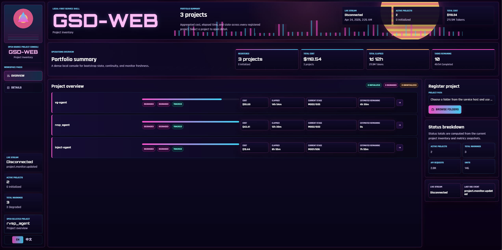
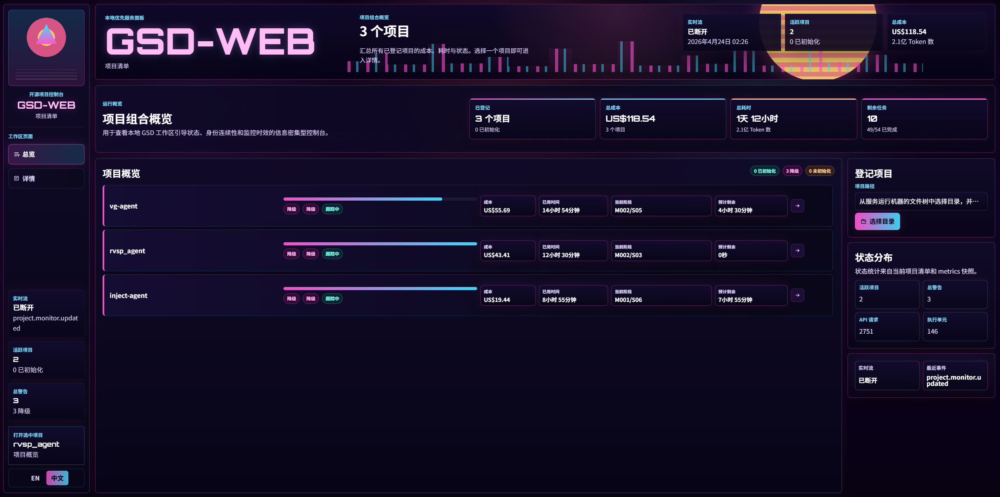
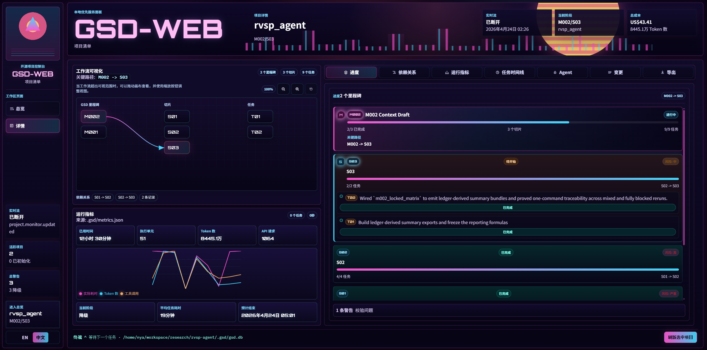
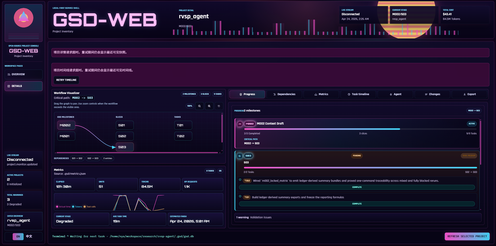

# gsd-web

[](https://www.npmjs.com/package/gsd-web)
[](https://www.npmjs.com/package/gsd-web)
[](https://github.com/ChenMiaoi/gsd-web)
[](LICENSE)

`gsd-web` is a local-first dashboard for GSD workspaces. It registers projects on your machine, watches their `.gsd` state, keeps a durable SQLite registry, and renders a React interface for project inventory, continuity, initialization, workflow progress, metrics, and timeline events.

## Screenshots

<table>
  <tr>
    <td></td>
    <td></td>
  </tr>
  <tr>
    <td></td>
    <td></td>
  </tr>
</table>

The project is designed for contributors who need to run the service locally, inspect project state safely, and extend the dashboard without changing the GSD workspace format.

## Star History

[](https://www.star-history.com/#ChenMiaoi/gsd-web&Date)

## What It Does

- Registers local project paths and assigns each project a stable `projectId`.
- Reads `.gsd` bootstrap artifacts in a read-only snapshot pass.
- Classifies projects as `initialized`, `uninitialized`, or `degraded`.
- Tracks path loss, recovery, relinking, refreshes, and monitor health.
- Starts supported `gsd init` flows from the browser UI.
- Streams project events to the UI with Server-Sent Events.
- Visualizes milestones, slices, tasks, dependencies, runtime metrics, model usage, and timeline activity.
- Supports English and Chinese UI copy.

## Requirements

- Node.js `>=24.0.0`
- npm
- Optional, for browser-triggered initialization:
  - `gsd`
  - `python3`

Node 24 is required because the server uses modern Node APIs, including the built-in SQLite binding.

## Quick Start

Run the published CLI without installing it globally:

```bash
npx gsd-web
```

Or install it as a global tool:

```bash
npm install --global gsd-web
gsd-web
```

`gsd-web` starts the service in the background by default. Use the process commands to inspect or manage it:

```bash
gsd-web status
gsd-web reload
gsd-web stop
```

Then open:

```text
http://127.0.0.1:3000
```

For repository development, install dependencies and build both the browser and server bundles:

```bash
npm install
npm run build
npm run start
```

For local development, run the TypeScript server directly:

```bash
npm run dev
```

The development server still serves the built browser bundle. Run `npm run build:web` after changing frontend code.

When installed as a package, the CLI entrypoint is:

```bash
gsd-web
```

## CLI

| Command | Purpose |
| --- | --- |
| `gsd-web` | Start the service in the background |
| `gsd-web start` | Start the service in the background |
| `gsd-web stop` | Stop the background service |
| `gsd-web reload` | Stop and start the background service |
| `gsd-web restart` | Alias for `reload` |
| `gsd-web status` | Show pid, URL, data path, and log path |
| `gsd-web serve` | Run in the foreground |

`start`, `reload`, `restart`, and `serve` accept explicit listen options:

```bash
gsd-web start --host 0.0.0.0 --port 3000
gsd-web serve --host 127.0.0.1 --port 3001
```

Use `--host 0.0.0.0` when the dashboard must be reachable through the machine's network IP instead of only through loopback. Treat that as local-network exposure and rely on your firewall or tunnel controls accordingly.

The daemon pid file is written to `GSD_WEB_HOME` as `gsd-web.pid`. By default, runtime data lives under `~/.gsd-web`.

## Using The Dashboard

1. Open the welcome page.
2. Enter the project overview.
3. Use the directory picker to register a server-side project directory.
4. Select a project to inspect its snapshot, monitor state, continuity, initialization job, workspace notes, source health, workflow data, metrics, and event history.
5. If a project path moves or disappears, use the relink flow to point the existing project record at the new path.

The dashboard keeps the last known good project information in the registry, so path loss does not erase the project from the inventory.

## Browser Routes

| Route | Purpose |
| --- | --- |
| `/lazy` | Welcome page |
| `/lazy/boss` | Project overview |
| `/lazy/employee-<projectId>` | Project detail |

The server returns the React shell for deep links, so refreshes and direct project URLs work.

The `/lazy` base path is intentional: the dashboard is for avoiding manual status checks by letting automated monitoring keep watch.

## Configuration

| Variable | Default | Purpose |
| --- | --- | --- |
| `HOST` | `127.0.0.1` | HTTP listen host |
| `PORT` | `3000` | HTTP listen port |
| `GSD_WEB_HOME` | `~/.gsd-web` | Runtime home |
| `GSD_WEB_DATABASE_PATH` | `~/.gsd-web/data/gsd-web.sqlite` | Registry database |
| `GSD_WEB_LOG_DIR` | `~/.gsd-web/logs` | Log directory |
| `GSD_WEB_LOG_FILE` | `~/.gsd-web/logs/gsd-web.log` | JSONL service log |
| `GSD_WEB_LOG_LEVEL` | `info` | Service log level |
| `GSD_WEB_LOG_RETENTION_DAYS` | `7` | Delete rotated archives older than this many days |
| `GSD_WEB_LOG_MAX_SIZE_MB` | `20` | Rotate the active log once it grows past this size |
| `GSD_WEB_REQUEST_LOGS` | `false` | Enable HTTP request access logs |
| `GSD_WEB_MONITOR_INTERVAL_MS` | `10000` | Periodic project monitor backstop interval |
| `GSD_WEB_CLIENT_DIST_DIR` | packaged browser build | Static frontend directory |
| `GSD_WEB_CONFIG_PATH` | `~/.gsd-web/config.json` | JSON config file path |
| `GSD_WEB_PUBLIC_URL` | unset | Public or tunnel URL used in Slack project detail links |
| `GSD_WEB_SLACK_WEBHOOK_URL` | unset | Slack Incoming Webhook URL for project event notifications |
| `GSD_WEB_SLACK_BOT_TOKEN` | unset | Slack bot token used with `chat.postMessage` |
| `GSD_WEB_SLACK_CHANNEL_ID` | unset | Slack channel ID for bot-token notifications |
| `GSD_WEB_SLACK_SIGNING_SECRET` | unset | Slack signing secret for slash command verification |
| `GSD_WEB_SLACK_EVENTS` | project events | Comma-separated event types to notify |
| `GSD_WEB_SLACK_STATUS_REPORT` | `false` | Send recurring Slack project status reports |
| `GSD_WEB_SLACK_STATUS_INTERVAL_MS` | `60000` | Recurring Slack status report interval |
| `GSD_WEB_SLACK_STATUS_IMMEDIATE_MIN_INTERVAL_MS` | `5000` | Minimum gap between change-triggered status reports |
| `GSD_WEB_SLACK_TIMEOUT_MS` | `5000` | Slack notification request timeout |
| `GSD_BIN_PATH` | `gsd` | Executable used by the init runner |

Example:

```bash
PORT=3001 GSD_BIN_PATH=/path/to/gsd gsd-web
gsd-web start --host 0.0.0.0 --port 3001
```

On first start, `gsd-web` creates a local config file at `~/.gsd-web/config.json` unless `GSD_WEB_HOME` or `GSD_WEB_CONFIG_PATH` points elsewhere. Environment variables override values from this file.

Slack notifications are disabled by default. To send GSD project events to Slack, edit `~/.gsd-web/config.json`:

```json
{
  "publicUrl": "https://your-tunnel.example.com",
  "slack": {
    "enabled": true,
    "webhookUrl": "https://hooks.slack.com/services/...",
    "signingSecret": "your-slack-signing-secret",
    "statusReportEnabled": true,
    "statusIntervalMs": 60000,
    "statusImmediateMinIntervalMs": 5000,
    "events": ["project.monitor.updated", "project.init.updated"],
    "timeoutMs": 5000
  }
}
```

For bot-token delivery instead of an Incoming Webhook, use:

```json
{
  "publicUrl": "https://your-tunnel.example.com",
  "slack": {
    "enabled": true,
    "botToken": "xoxb-...",
    "channelId": "C0123456789",
    "signingSecret": "your-slack-signing-secret"
  }
}
```

The bot-token path uses Slack `chat.postMessage`; the app needs the `chat:write` scope and the bot must be invited to the target channel.

To query gsd-web from Slack, create a Slash Command in the Slack app, set its request URL to:

```text
https://your-tunnel.example.com/api/slack/commands
```

Then set `slack.signingSecret` in `~/.gsd-web/config.json`. Supported command text:

```text
/gsd
/gsd status
/gsd projects
/gsd project <project id, name, or path>
/gsd help
```

You can also configure an Incoming Webhook with environment variables:

```bash
GSD_WEB_SLACK_WEBHOOK_URL='https://hooks.slack.com/services/...' \
GSD_WEB_PUBLIC_URL='https://your-tunnel.example.com' \
gsd-web serve
```

Or configure a Slack app bot token:

```bash
GSD_WEB_SLACK_BOT_TOKEN='xoxb-...' \
GSD_WEB_SLACK_CHANNEL_ID='C0123456789' \
GSD_WEB_PUBLIC_URL='https://your-tunnel.example.com' \
gsd-web serve
```

By default, Slack receives project lifecycle, refresh, monitor, relink, delete, and init updates. Use `GSD_WEB_SLACK_EVENTS` to narrow the stream, for example:

```bash
GSD_WEB_SLACK_EVENTS='project.monitor.updated,project.init.updated' gsd-web serve
```

Set `slack.statusReportEnabled` to `true` to send a recurring project status report. The report includes the current project, progress, health, cost, warnings, token count, and estimated finish time. The default interval is 60 seconds. Important state changes, such as monitor degradation/recovery, project refresh changes, relinks, deletes, registrations, and terminal initialization jobs, send an immediate report subject to `statusImmediateMinIntervalMs`.

Service logs stay in the configured active file and rotate automatically when the local day changes or the file exceeds the configured size. Rotated archives are gzip-compressed and named like `gsd-web-YYYY-MM-DD.log.gz`, with `-1`, `-2`, and so on added when multiple archives are produced on the same day. The effective log policy is visible in `gsd-web status` and `GET /api/health`.

## Architecture

The code is split into a few layers:

- **HTTP service**: creates the Fastify app, serves static frontend assets, exposes health checks, and wires routes.
- **Registry database**: owns SQLite persistence for projects, snapshots, monitor state, init jobs, and timeline entries.
- **Snapshot reader**: inspects GSD workspace artifacts without mutating the project directory.
- **Reconciler and monitor**: refresh project records, detect path continuity changes, and publish timeline events.
- **Project routes**: handle registration, refresh, relink, initialization, timeline reads, and directory browsing.
- **Shared contracts**: define the server-to-browser response and event shapes.
- **Browser app model**: validates API responses, formats state, derives portfolio summaries, and calculates workflow metrics.
- **Browser components**: render the application shell and reusable workflow visualizations.

This keeps IO, persistence, contracts, derived view data, and UI rendering separate enough that a contributor can change one layer without rewriting the others.

## API

| Method | Endpoint | Purpose |
| --- | --- | --- |
| `GET` | `/api/health` | Service health and schema version |
| `GET` | `/api/projects` | Registered project inventory |
| `POST` | `/api/projects/register` | Register a local project path |
| `GET` | `/api/projects/<projectId>` | Project detail with recent timeline |
| `GET` | `/api/projects/<projectId>/timeline` | Project timeline |
| `POST` | `/api/projects/<projectId>/refresh` | Force a snapshot refresh |
| `POST` | `/api/projects/<projectId>/init` | Start supported GSD initialization |
| `POST` | `/api/projects/<projectId>/relink` | Attach a lost project record to a new path |
| `GET` | `/api/filesystem/directories` | Browse server-side directories for registration |
| `GET` | `/api/events` | Server-Sent Events stream |

Example registration:

```bash
curl -X POST http://127.0.0.1:3000/api/projects/register \
  -H 'content-type: application/json' \
  -d '{"path":"/absolute/path/to/project"}'
```

Example event stream:

```bash
curl -N http://127.0.0.1:3000/api/events
```

## Snapshot Model

A project without a `.gsd` directory is `uninitialized`.

A project with complete and readable GSD bootstrap data is `initialized`.

A project with missing, unreadable, or malformed GSD data is `degraded`. The snapshot includes warnings for each affected source so the UI can show what needs attention.

The reader checks directory presence, project identity, repository metadata, lock state, state notes, runtime metrics, and workflow database summaries where available.

## Development

```bash
npm run clean
npm run build
npm run build:web
npm run build:server
npm run dev
npm test
npm run test:e2e
```

Before opening a pull request, run:

```bash
npm run build
npm test
npm run test:e2e
```

GitHub Actions runs the same build, integration test, and browser test checks on pushes and pull requests.

## Publishing

The package is prepared for public npm publishing under the `gsd-web` name. The npm package contains only the compiled server, shared contracts, browser bundle, README, package manifest, and license.

Before publishing, verify the package contents:

```bash
npm run verify:publish
```

To inspect the tarball contents without publishing:

```bash
npm pack --dry-run
```

To publish:

```bash
npm login
npm publish
```

`prepublishOnly` runs the production build and package-content check, so an accidental source/test-heavy tarball should fail before upload.

## Contribution Notes

- Keep server responses and browser parsers aligned with the shared contracts.
- Prefer read-only project inspection unless a route explicitly performs a user-requested action.
- Preserve existing project IDs during refresh and relink flows.
- Add integration tests for server behavior and Playwright tests for user-visible workflows.
- Keep browser view logic in derived model helpers when it is shared across panels.
